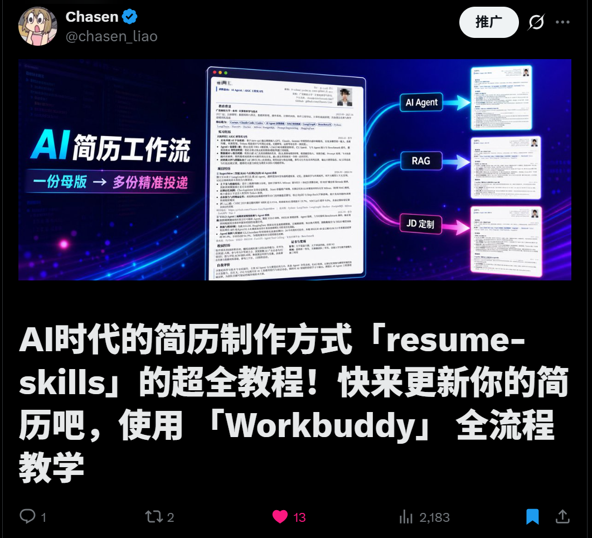
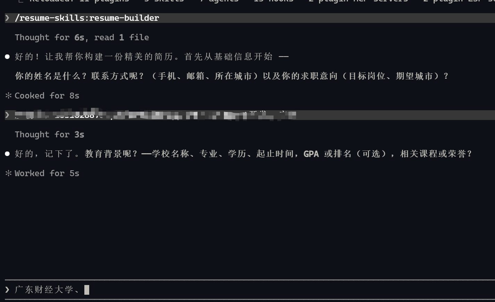
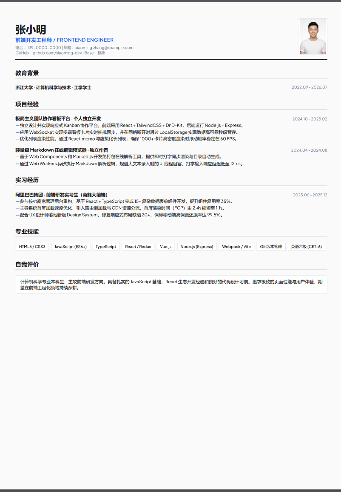
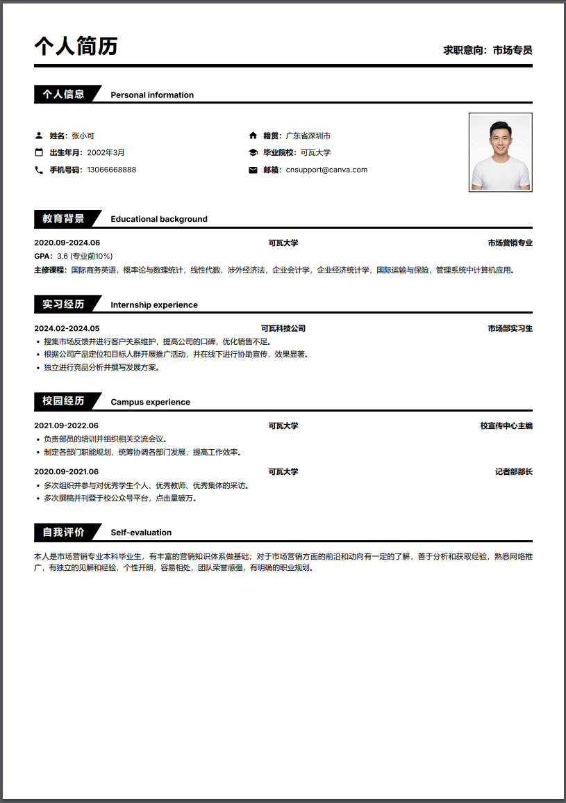
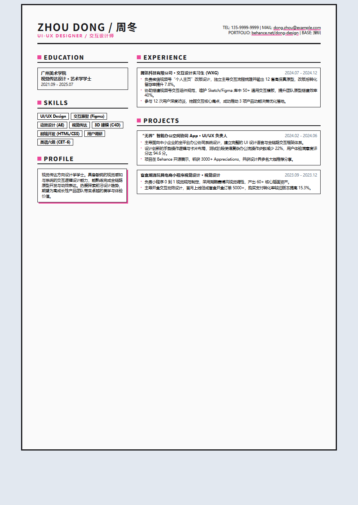
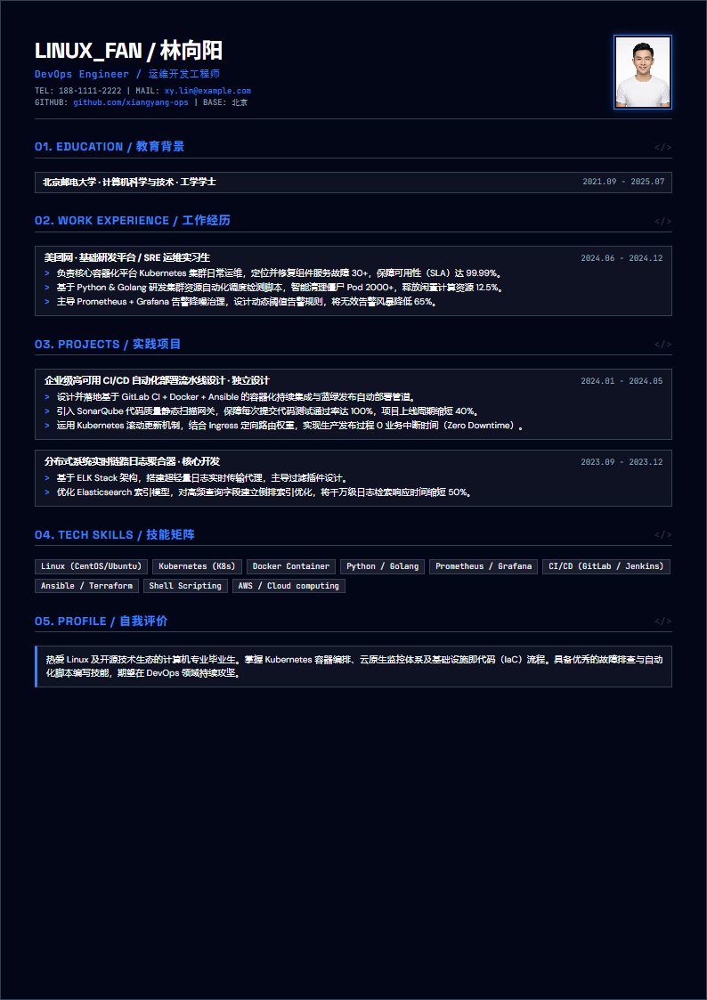
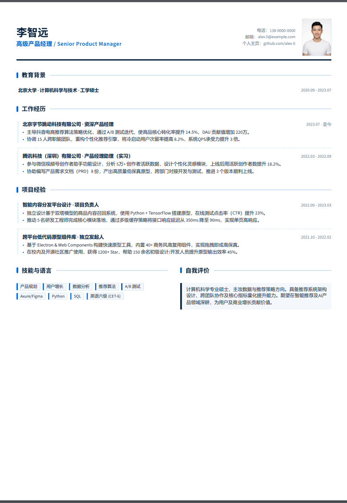
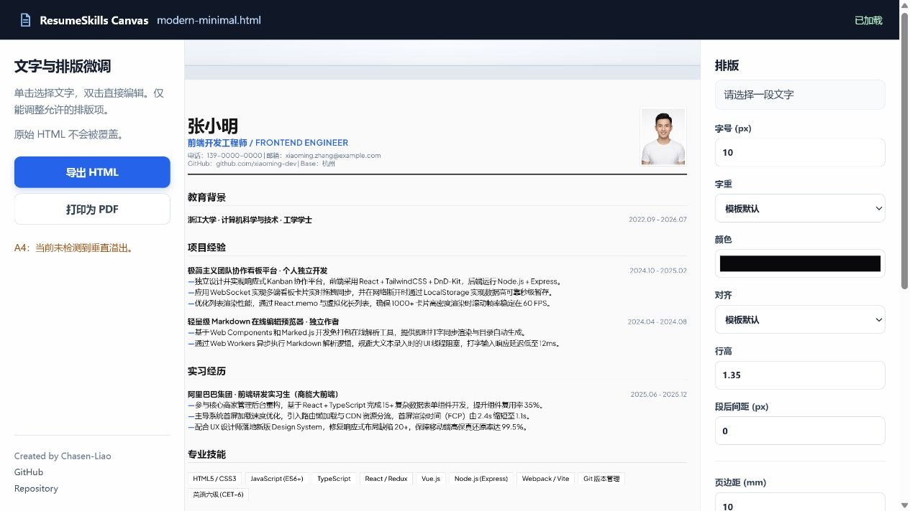

# Resume Skills

> 详细教程参考我的 X 推文：https://x.com/chasen_liao/status/2077689805752942619?s=20



这是一个面向 Codex、Claude Code 和其他兼容 Agent Skills 的简历工作流技能。

它把做简历拆成一条可复用的工作流：从已有简历解析并补充，或从真实经历采访开始，建立一份简历母版；再分析目标 JD、生成岗位定制版、检查 ATS 可读性，并维护不同投递版本。生成的简历是独立 HTML，可在浏览器中打印为 PDF；视觉版还可以用附带的本地 Canvas 做最后的文字和排版微调。

> 这不是一个独立的在线简历网站，而是一组让你的 Agent 按稳定流程工作的 Skills。你仍然需要在 Codex、Claude Code 或其他兼容客户端中与 Agent 对话。

完整的分章节安装与使用指南见：[Resume Skills GitHub Pages 教程](https://chasen-liao.github.io/resume-skills/)（[页面源码](docs/index.html)）。



## 适合谁

- 想先整理一份可长期维护的简历母版，再针对不同岗位投递的人
- 希望 Agent 先采访和核对事实，而不是直接套模板编内容的人
- 需要同时保留视觉版和 ATS-safe 单栏版简历的人
- 需要管理多家公司、多岗位投递版本的人

## 30 秒开始

### 1. 安装全部 Skills

先确保本机已安装 Node.js 20 或更高版本，然后在终端执行：

```bash
npx skills add Chasen-Liao/resume-skills
```

也可以先查看仓库中的 Skill 列表，不立即安装：

```bash
npx skills add Chasen-Liao/resume-skills --list
```

安装完成后，重新打开或新建 Agent 会话。

### npm 包：本地 Canvas 编辑器

本仓库同时发布了 npm 包 [`@chasen-liao/resume-skills`](https://www.npmjs.com/package/@chasen-liao/resume-skills)，当前版本为 `0.4.4`。

- GitHub 仓库中的 `SKILL.md`：提供简历采访、JD 定制、ATS 检查和版本管理流程
- npm 包：提供 `resume-skills` CLI 和本地 Canvas 编辑器

Skill 的安装不依赖 npm 包；只有需要手动打开本地 Canvas 时才需要使用 npm CLI：

```bash
npx @chasen-liao/resume-skills editor resume-visual.html
```

也可以全局安装后使用：

```bash
npm install --global @chasen-liao/resume-skills
resume-skills editor resume-visual.html
```

包地址：<https://www.npmjs.com/package/@chasen-liao/resume-skills>

### 2. 选择入口

#### 空的简历工作区：先建立母版

没有 `resume-facts.yaml` 和母版时，调用 `resume-workflow`。可以导入已有简历或采访真实经历，确认事实后生成母版：

```text
使用 `resume-workflow` 帮我创建或更新简历。我想申请前端开发实习，请先确认事实，不要编造任何经历或数据。
```

你不需要先准备固定格式的简历。已有简历会走“**解析 → 确认 → 增量追问**”：先确认已识别内容，再只补充模糊、缺失或可能过期的信息；没有简历时，Agent 才会逐步采访个人信息、教育背景、经历、项目和技能。事实确认完成后，再选择输出模式与视觉风格。

#### 已有母版：输入 JD 生成岗位版本

已有 `resume-facts.yaml` 和母版后，直接输入 JD 文本或文件：

```text
请用我的简历母版分析这份 JD，先告诉我匹配点和真实缺口，再生成定制版。不要把 JD 要求当成我的经历。
```

`jd-tailorer` 会输出岗位定制版和匹配分析，不会覆盖你的母版。

## 你可以使用的 7 个 Skills

| Skill | 什么时候用 | 主要输入 | 主要输出 |
|---|---|---|---|
| `resume-workflow` | 希望由 Agent 串联完整流程，不想自己选择 skill | 已有简历或真实经历；可附 JD | 已确认事实库、母版、定制版、审计与版本记录 |
| `resume-builder` | 创建或更新简历母版 | 已有简历或你的真实个人信息、教育、经历、项目、技能 | 经确认的母版、视觉版或 ATS-safe 版 HTML/PDF |
| `job-description-analyzer` | JD 定制前分析，或单独判断是否值得投递 | JD 文本/文件 + 简历母版或事实 | 要求地图、匹配证据、真实缺口与定制优先级 |
| `jd-tailorer` | 为一个具体公司和岗位定制简历 | 简历母版 + JD 分析 | 变更预览确认后的定制 HTML/PDF + `matching-analysis.md` |
| `resume-bullet-writer` | 条件触发：经历描述职责化、贡献不清或证据不足时 | 原始描述、真实职责/结果，可附目标 JD | 有证据支持的改写候选、诊断与待确认问题 |
| `resume-ats-optimizer` | 母版或定制版生成后的质量关卡 | HTML、PDF、文本，可附 JD | ATS 风险清单、关键词与结构优化建议 |
| `resume-version-manager` | 在确认节点保存母版、定制版和投递记录 | 现有文件、目标岗位、版本记录 | 版本命名、目录结构、变更摘要与 Git 维护策略 |

### 推荐工作流

```text
空的简历工作区 → resume-workflow → 建立事实库与母版

已有简历 ──→ 解析 → 确认 → 增量追问 ──┐
                                        ├→ resume-builder → 母版简历
从零开始 ──→ 逐步采访 ─────────────────┘
    ├─ 条件触发：经历职责化/证据不足 → resume-bullet-writer → 用户确认后更新事实库
    ↓
输入 JD → job-description-analyzer → 匹配点、真实缺口与定制策略
    ↓
jd-tailorer → 变更预览 → 用户确认 → 岗位定制版
    ↓
resume-ats-optimizer（质量关卡：报告风险，不静默改写）
    ↓
resume-version-manager（记录确认后的版本与投递历史）
```

`resume-bullet-writer`、`job-description-analyzer` 和 `resume-ats-optimizer` 都可以单独使用；它们不会绕过事实确认或静默覆盖母版。

## 两种输出模式

开始生成前，Agent 会让你选择模式。两种模式使用同一份已确认的事实，不会因为换版式而增加经历。

### 视觉 HTML/PDF

适合人工阅读、作品集和需要更强视觉层次的场景。内置 6 种 A4 风格：

<table>
<tr>
  <td align="center"><b>现代简约</b></td>
  <td align="center"><b>经典商务</b></td>
  <td align="center"><b>创意个性</b></td>
</tr>
<tr>
  <td></td>
  <td></td>
  <td></td>
</tr>
<tr>
  <td align="center">留白、高对比、克制</td>
  <td align="center">深蓝、稳重、专业</td>
  <td align="center">大胆配色、强辨识度</td>
</tr>
<tr>
  <td align="center"><b>日式极简</b></td>
  <td align="center"><b>科技感</b></td>
  <td align="center"><b>简约蓝色商务</b></td>
</tr>
<tr>
  <td></td>
  <td></td>
  <td></td>
</tr>
<tr>
  <td align="center">暖色、轻质、呼吸感</td>
  <td align="center">深色、高对比、终端美学</td>
  <td align="center">深蓝、清晰、商务极简</td>
</tr>
</table>

视觉版以 A4 单页为目标。`resume-builder`、`jd-tailorer` 或 `resume-workflow` 生成视觉母版或视觉定制版并完成 PDF 验证后，交付流程必须执行 `npx @chasen-liao/resume-skills editor <实际生成的_visual.html路径>`，启动本地 Canvas 预览；若当前环境不能执行 `npx`，Agent 必须明确说明未启动并给出完整手动命令。内容过多时，应优先删减或确认事实，而不是为了塞进一页而缩小到难以阅读。

### ATS-safe HTML/PDF

适合招聘平台或机器解析风险较高的投递场景。它使用单栏布局、标准章节标题、可复制文本和清晰的阅读顺序，尽量减少图片、复杂表格和装饰对解析的影响。

ATS-safe 只是降低解析风险，不代表一定通过任何 ATS，也不代表一定获得面试。当前项目输出 HTML 和浏览器打印 PDF，不生成 DOCX。

## 本地 Canvas 编辑器

Canvas 只负责已生成视觉简历的最后排版微调，不负责采访、改写、JD 匹配或重新设计结构。

下面是通过 `npx @chasen-liao/resume-skills editor <resume.html>` 打开的实际网页界面：

<p align="center">
  
</p>

### 这个界面怎么用

1. **打开视觉版 HTML**：在简历文件所在目录执行下面的命令。编辑器会启动本机服务，并尝试自动打开浏览器。

   ```bash
   npx @chasen-liao/resume-skills editor resume-visual.html
   ```

2. **选择并编辑文字**：在中间的 A4 画布上单击文字进行选择；双击已有文字可以直接编辑。编辑器只允许修改已有文本。

3. **调整排版**：选中文字后，在右侧“排版”面板调整字号、字重、颜色、对齐、行高和段后间距；页面级设置可以调整页边距和主题色。修改会实时反映在画布中。

4. **检查页面状态**：左侧会显示 A4 垂直溢出提示。出现溢出时，先回到内容或排版流程处理，不要把字号压缩到难以阅读。

5. **导出修改后的 HTML**：点击左侧“导出 HTML”，会在原文件同目录生成或覆盖 `<原文件名>-edited.html`。原始 HTML 始终不会被覆盖。

6. **打印 PDF**：点击“打印为 PDF”，在浏览器打印面板中选择 A4，并按需要关闭浏览器默认的页眉和页脚后保存。

草稿会保存在当前浏览器中；关闭页面前请导出 HTML 或打印 PDF。ATS-safe 单栏 HTML、普通外部模板和不带编辑协议的 HTML 不一定能被 Canvas 打开。

可以调整：

- 已有文字
- 字号、字重、颜色和对齐方式
- 行高、段后距、页边距和主题色

不支持：

- AI 改写或自动补充经历
- JD 分析和关键词匹配
- 自由拖拽、结构重排或图片编辑
- ATS-safe 单栏模板

对已有视觉 HTML 手动打开编辑器：

```bash
npx @chasen-liao/resume-skills editor resume-visual.html
```

编辑器会在本机启动服务并尝试打开浏览器。原始 HTML 不会被覆盖；点击“导出 HTML”后，会在同目录生成或覆盖：

```text
resume-visual-edited.html
```

点击“打印为 PDF”后，在浏览器打印面板中选择 A4 并保存 PDF。若浏览器没有自动打开，请直接打开终端中显示的本地地址。

## 文件会如何组织

在**项目目录外**创建本地私有工作区，推荐保持“事实库和母版不动、定制版分目录”：

```text
resume/
├── resume-facts.yaml                 # 唯一事实源；不存放未确认内容
├── resume-visual.html
├── resume-visual.pdf
├── resume-ats.html
├── resume-ats.pdf
└── tailored/
    └── company-role/
        ├── resume-visual.html
        ├── resume-visual.pdf
        ├── resume-ats.html
        ├── resume-ats.pdf
        └── matching-analysis.md
```

`resume-facts.yaml` 使用 `resume-facts.example.yaml` 的结构，保存每条事实的来源、证据、置信度和确认时间。`jd-tailorer` 和 `resume-version-manager` 都遵循这个思路：定制版只能基于已确认事实进行重排、强调和改写，除非你明确要求，否则不回写或覆盖母版。

### 用 Git 保留版本历史（推荐）

可以将项目目录外的整个 `resume/` 工作区放入**本地私有 Git 仓库**。在确认事实库/母版变更或生成一份岗位定制版后创建一次提交，就可以清楚比较、恢复和追溯每次投递的依据；只有在试验互斥的母版方向时才需要分支。源码仓库根目录下的 `resume/` 已被忽略，避免误提交个人数据。

简历包含个人信息，**不应推送到公开远程仓库**。Agent 不会自动初始化仓库、提交、推送或覆盖历史；这些会改变版本历史的操作都需要你确认。

## 重要边界

- 不编造经历、技能、指标、证书、公司或 JD 匹配结果。
- JD 中的关键词是目标要求，不是你的个人事实；缺失项会被标记为缺口，而不是被补进简历。
- 待确认的信息只能留在采访记录或匹配报告中，不能进入最终简历成稿。
- “匹配度”是基于已提供材料的可解释比较，不是录用概率。
- “ATS-safe”是结构和可解析性建议，不是对任何招聘系统的保证。
- 你应在投递前核对联系方式、时间、数字、链接、页数和 PDF 中的文字复制结果。

## 常用对话示例

### 从零创建简历

```text
帮我创建一份后端开发实习简历。
请先逐步采访我，再让我选择视觉版或 ATS-safe 版。
所有经历和指标都必须来自我确认的信息。
```

### 改写经历，但不编数据

```text
请优化下面三条项目经历，目标岗位是 Python 后端实习。
可以调整表达和顺序，但不要补充我没有提供的数字、技术或成果。
```

### 先分析 JD，再决定是否投递

```text
请分析这份 JD：列出硬性要求、加分项、关键词、我的匹配证据和真实缺口。
先不要改写简历。
```

### 定制一个岗位版本

```text
请根据这份 JD 定制我的简历。
保留母版，说明每处重排和改写的事实来源，并同时检查视觉版和 ATS-safe 版是否适合这个岗位。
```

### 投递前做 ATS 检查

```text
请检查这份 resume-ats.pdf 的文本提取顺序、章节结构和 JD 关键词覆盖。
请把解析风险和真实内容缺口分开说明，不要承诺一定通过 ATS。
```

## 常见问题

### Agent 没有自动使用 Skill

重新打开或新建会话，然后在请求中明确写出 Skill 名称，例如 `resume-workflow`、`resume-builder` 或 `jd-tailorer`。也可以在客户端支持时使用 `$resume-workflow` 这样的显式调用方式。

### `jd-tailorer` 提示缺少参考文件

重新安装全部 Skills：

```bash
npx skills add Chasen-Liao/resume-skills --skill '*' --agent codex --yes
```

`jd-tailorer` 与几个辅助 Skill 会共享 `resume-builder` 的事实契约和写作规范；只安装单个 Skill 可能缺少这些参考文件。

### Canvas 无法打开某个 HTML

Canvas 只接受带 Resume Skills 编辑协议的内置视觉模板。ATS-safe HTML、普通外部模板或手写 HTML 不一定支持；请回到 Agent 重新生成视觉版，或直接用浏览器打开 HTML 并打印 PDF。

### PDF 超过一页或排版溢出

先确认是否有可以删减的低相关内容，再让 Agent 做排版调整。不要删除关键事实、压缩到不可读的字号，或把未确认信息塞进空白区域。

## 相关链接

- [Agent Skills 开放规范](https://agentskills.io/specification)
- [`skills` CLI 文档](https://www.skills.sh/docs/cli)
- [npm 包：`@chasen-liao/resume-skills`](https://www.npmjs.com/package/@chasen-liao/resume-skills)
- [Resume Skills 源码仓库](https://github.com/Chasen-Liao/resume-skills)

## License

MIT
