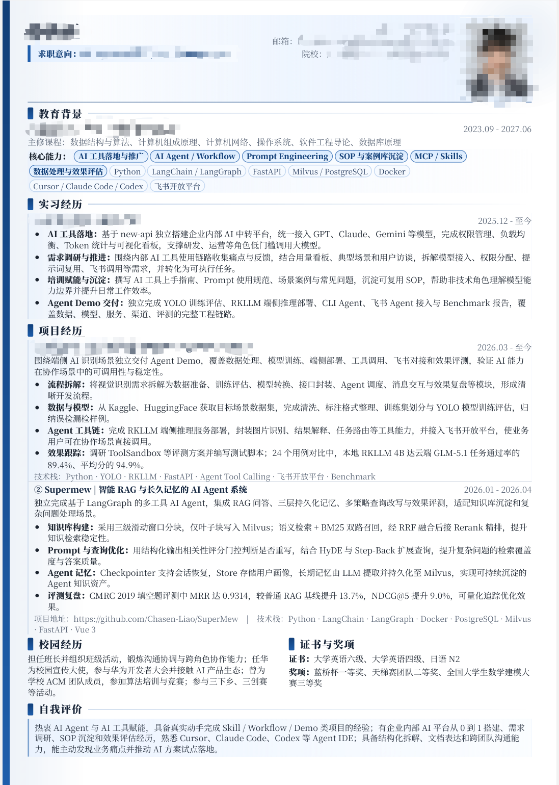

# Resume Skills — Claude Code 插件

一套基于 HTML 的简历生成与 JD 匹配工具集，作为 Claude Code 插件使用。

“这一套skills是我在制作简历中和投递简历中总结出来的，先用 resume-builder 生成一份通用的简历母版，之后只需要发送对应的 JD.md 给Agent，Agent就可以针对JD来生成对应的简历”

> 帮你优化简历和针对JD来制作对应岗位的简历！
> 祝愿你能通过本skills来找到更好的工作！

## 技能概览


## 生成效果展示

现代简约风格：



### 1. resume-builder — 简历构建器

通过对话式采访，帮用户构建精美的 A4 HTML 简历。核心理念：**美观 + 单页 + ATS 兼容**。

| 功能 | 说明 |
|------|------|
| 对话式收集 | 逐步引导填写：个人信息、教育背景、实习/工作、项目、技能、校园经历、自我评价 |
| 5 种设计风格 | 现代简约、经典商务、创意个性、日式极简、科技感 |
| 15 套配色方案 | 每个风格 3 套完整色板（Primary/Accent/Background/Foreground/Card/Muted/Border） |
| 13 组字体搭配 | 标题/正文配对，支持中英文混排 |
| A4 单页强约束 | 紧凑排版参数 + 双栏布局 + PDF 导出验证 |
| ATS 兼容 | 标准章节标题、inline 技能标签、纯文本可读性 |
| STAR 写作法则 | 每条经历强制量化数据，三句话自我评价 |
| 输出格式 | 独立 HTML 文件（inline CSS/JS），浏览器直接打印 PDF |

### 2. jd-tailorer — JD 简历定制器

根据具体职位描述，对已有简历进行关键词匹配和内容定制。核心理念：**关键词对齐 + 不编造经历**。

| 功能 | 说明 |
|------|------|
| JD 解析 | 自动提取核心技术、加分项、软技能关键词、公司文化暗示 |
| 匹配分析 | 对比简历与 JD，识别匹配点/缺失点/弱化点 |
| 关键词优化 | 术语对齐 + 自然融入 JD 关键词（目标覆盖率 ≥ 70%） |
| 板块重排序 | 按 JD 关注度重新排列板块优先级 |
| 定制版 vs 通用版对比 | 清楚说明改了哪些关键词、重排了哪些板块 |
| 输出结构 | `tailored/<公司名>-<岗位>/resume.html` + `matching-analysis.md` |

## 推荐工作流

```
resume-builder → 生成通用版简历 → jd-tailorer → 针对不同 JD 生成定制版本
```

先建立一份内容扎实、排版美观的通版简历，再针对每个目标岗位做 JD 定制，比海投同一份简历的通过率高数倍。

## 安装

### 方式一：通过 GitHub 链接安装（推荐）

1. 打开 Claude Code，输入 `/plugin`
2. 在插件管理界面选择「安装插件」
3. 粘贴本仓库地址：
   ```
   https://github.com/Chasen-Liao/resume-skills
   ```
4. 确认安装，Claude Code 会自动拉取仓库并注册两个技能

> 此方式需要本地已安装 Git，且网络可访问 GitHub。

### 方式二：通过 .skill 文件安装

如果你只想安装其中一个技能，或离线环境使用：

1. 从 [Releases](https://github.com/Chasen-Liao/resume-skills) 页面下载 `resume-builder.skill` 或 `jd-tailorer.skill`
2. 打开 Claude Code，输入 `/plugin`
3. 在插件管理界面选择「安装插件」
4. 选择下载的 `.skill` 文件

### 方式三：本地克隆后安装

1. 先克隆仓库到本地：
   ```bash
   git clone https://github.com/Chasen-Liao/resume-skills.git
   ```
2. 打开 Claude Code，输入 `/plugin`
3. 选择「安装插件」→「从本地安装」
4. 指向克隆下来的 `resume-skills` 目录

### 安装后验证

安装成功后，在 Claude Code 中以自然语言输入即可触发技能：

- **测试 resume-builder**：输入「帮我做一份简历」，Claude 会自动加载简历构建器技能
- **测试 jd-tailorer**：输入「帮我针对这个 JD 改一下简历」，Claude 会自动加载 JD 定制器技能

如果技能没有自动触发，可以手动输入 `/skill:resume-builder` 或 `/skill:jd-tailorer` 来激活。

## 使用示例

### 构建全新简历

```
用户: 帮我做一份简历
Claude: 好的，让我帮你构建一份精美的简历。首先，能告诉我你的姓名和求职意向吗？
用户: 张小明，前端开发工程师，Base 杭州，浙大计算机 2026 届
Claude: 明白了。接下来能告诉我你的教育背景吗？学校、专业、学历、时间...
用户: [逐一回答]
Claude: [展示 5 种设计风格供选择]
用户: 现代简约
Claude: [生成 resume.html，导出 PDF，验证单页] ✅ 已生成你的简历，保存在 ./resume/resume.html
```

### 针对 JD 定制简历

```
用户: 帮我针对阿里的 JD 改一下简历
Claude: 好的，请把阿里的 JD 内容粘贴给我
用户: [粘贴 JD 文本]
Claude:
  分析完这个 JD，核心要求：
  - React / TypeScript 前端框架
  - 组件库 / 设计系统经验
  - 性能优化 & 工程化能力

  你的「组件库项目」与这个岗位高度相关，我会把它前置。
  另外 JD 提到「工程化」，你的项目中可以强调 CI/CD 部分。

  [生成定制版 → PDF 验证单页 → 输出匹配分析报告]
  定制要点：
  - 新增关键词: 设计系统、CI/CD、Monorepo（从项目中提取）
  - 板块重排: 组件库项目 → 排到第一条
  - 自我评价重写: 对齐到「前端工程化」方向
```

## 技能体系结构

### resume-builder 的参考文档

技能在执行时会按需读取这些文档，不需要你手动查阅：

```
skills/resume-builder/
├── SKILL.md                          # 技能主文件（工作流程、约束、示例）
└── references/
    ├── design-guidelines.md          # 设计美学指南（字体/色彩/空间/动画原则）
    ├── color-palettes.md             # 五大风格-配色索引（指向 css/ 子文件夹）
    ├── content-writing.md            # 内容写作规范（STAR 法则 / 量化 / ATS 兼容）
    └── css/
        ├── README.md                 # CSS 子文件夹使用说明
        ├── common.md                 # 通用紧凑排版 CSS（每次生成必用）
        ├── modern-minimal.md         # 现代简约风格（3 套配色 + 字体 + 风格 CSS）
        ├── classic-business.md       # 经典商务风格（3 套配色 + 字体 + 风格 CSS）
        ├── creative-bold.md          # 创意个性风格（3 套配色 + 字体 + 风格 CSS）
        ├── japanese-minimal.md       # 日式极简风格（3 套配色 + 字体 + 风格 CSS）
        └── tech-dark.md              # 科技感风格（3 套配色 + 字体 + 风格 CSS）
```

### 设计约束的执行链

```
用户选择风格
    ↓
读取 css/<style>.md  →  获取 3 套配色变量 + 推荐字体 + 风格 CSS 要点
    ↓
读取 css/common.md   →  获取通用排版（页面尺寸/技能标签/双栏布局/防断裂）
    ↓
合并写入 HTML <style>
    ↓
按 content-writing.md 规范填充内容（STAR + 量化 + ATS 兼容标题）
    ↓
导出 PDF → 检查页数 → 溢出则修复 → 循环
    ↓
交付
```

### jd-tailorer 的协作方式

jd-tailorer 依赖 resume-builder 的输出格式：
- **复用视觉样式**：从基础简历 HTML 中提取 CSS 变量和布局结构
- **遵循写作规范**：沿用 `content-writing.md` 的 STAR 法则和量化标准
- **独立输出**：生成到 `tailored/` 子文件夹，不覆盖原文件
- **PDF 验证**：与 resume-builder 相同的单页验证流程

## 生成文件示例

```
resume/
├── resume.html                       # 通用版简历
└── tailored/
    ├── alibaba-前端开发/
    │   ├── resume.html               # 针对阿里的定制版
    │   └── matching-analysis.md      # 匹配分析报告
    └── tencent-后端开发/
        ├── resume.html
        └── matching-analysis.md
```

## 设计哲学：几个关键取舍

**美观 vs ATS 兼容**
HTML 简历的视觉效果与 ATS 的纯文本解析存在天然冲突（如双栏布局、色块标签）。
折中策略：HTML 提供美观的打印 PDF 版本，同时确保正文内容在语义上从上到下排列，
技能标签使用 `·` 分隔的 inline 文字，章节标题用标准命名。投递传统 ATS 系统时建
议额外导出 .docx 版本。

**单页 vs 内容丰富**
应届生简历必须在 1 页内完成。宁可精简弱关联内容，也不要溢出到第 2 页。紧凑排版
参数（页边距 10mm、行高 1.35、正文字号 10.5px）是保证单页的基础。

**通用 vs 定制**
通用版简历用于海投和存档，定制版针对具体 JD 做关键词对齐和板块重排。同一份经历
在不同 JD 下用不同的措辞和排序是完全合理的——只要内容真实。

## 触发关键词

### resume-builder 触发词
「简历」「resume」「CV」「求职」「找工作」「面试」「制作简历」「生成简历」「构建简历」

### jd-tailorer 触发词
「JD」「职位描述」「岗位匹配」「针对...改简历」「投递」「求职」「招聘要求」「Job Description」「定制简历」

## License

MIT
