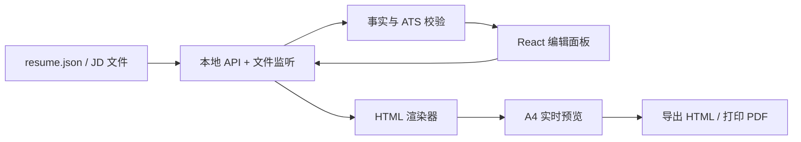

# ResumeSkills 对比研究与本地可视化编辑器方案

研究日期：2026-07-15（2026-07-16 更新）。本文记录产品研究。写作能力层已新增四个适配后的 skill；“完整 JSON 工作台”计划已被下文的“已确认 P0”替代。

## 结论

值得做本地 Web 编辑器，但**不应把生成的 HTML 当作唯一数据源**。推荐把“结构化且带证据的简历数据”作为唯一事实源，HTML 作为可实时再生成、可打印和可交付的渲染产物。这样才能同时获得：

- AI 生成后的可视化微调；
- 针对不同 JD 的可追溯版本；
- 现有 `resume-contract.md` 的真实性约束；
- 视觉版与 ATS-safe 版内容一致；
- 不固定视觉模板：模板只是可替换的渲染皮肤，不是限制写作的格式。

现有仓库应优先借鉴 Paramchoudhary/ResumeSkills 的**写作能力拆分**，再借鉴 mdnice 的**所见即所得单页画布**。不要复刻 mdnice 的富文本直接编辑模型；它适合手工排版，但容易让内容、HTML 和 JD 定制版本失去共同的结构化事实源。

## 研究对象

| 对象 | 已验证定位 | 最值得借鉴 | 不宜直接照搬 |
|---|---|---|---|
| 当前仓库 `resume-builder` + `jd-tailorer` | 对话收集事实，生成独立 A4 HTML；按 JD 做关键词和版块重排 | HTML/PDF 验证、视觉/ATS 两种输出、`resume-contract.md` 的事实证据字段 | 现在缺少可编辑的中间数据模型、版本浏览和人机协作界面 |
| [Paramchoudhary/ResumeSkills](https://github.com/Paramchoudhary/ResumeSkills) | 20 个围绕求职全链路的 Markdown skill | 将 ATS、JD 分析、bullet 改写、量化、版本管理、求职信、面试准备拆开，按需要组合 | 示例大量基于西方职场和“每条都量化”的假设；其“估算数字”建议与当前仓库的事实契约冲突，不能采用 |
| [mdnice/markdown-resume](https://github.com/mdnice/markdown-resume) / [在线版](https://resume.mdnice.com/) | Markdown + 富文本在线简历排版工具，桌面端、单页、PDF 导出 | A4 画布上的实时编辑、少量工具栏、模板切换、导入/导出；操作路径极短 | 项目 README 也说明只支持单页 PDF、以编辑排版为主；没有 AI 事实校验、JD 工作流、版本关系或 ATS 双视图 |
| [CVAurum](https://github.com/akhil-dara/cvaurum) | 本地优先的开源简历工作室 | Canvas 内联编辑和表单双向同步、撤销/重做、自动保存、JD 匹配、ATS 文本视图、拖拽重排 | 52 个模板和大量局部样式会显著扩大维护面；当前项目的 MVP 不需要复刻其全量设计系统 |
| [Reactive Resume](https://github.com/AmruthPillai/Reactive-Resume) | 开源、重视隐私和可定制性的完整简历产品 | 可作为后续自托管、多简历管理、账户体系的参考 | 不是本仓库第一阶段应引入的完整服务端产品边界 |

来源说明：ResumeSkills README 列出 20 个专用 skill 和安装方式；mdnice README 声明 Markdown/富文本、桌面编辑、单页 PDF；CVAurum README 说明数据本地保存、内联编辑与表单同步、实时 ATS 视图。上述结论均以这些公开说明和对 mdnice 在线版实际界面的只读检查为依据。

## 对当前技能的具体增益

### 1. 采用“写作能力模块”，但不必立即拆成 20 个 skill

Paramchoudhary 的优势是把复杂任务拆成明确、可复用的职责。当前仓库已将最能补齐短板的四项能力作为独立 skill 加入；它们与 `resume-builder`、`jd-tailorer` 互补，而不是替代：

| 建议能力 | 参考来源 | 与现有能力的关系 | 第一阶段产物 |
|---|---|---|---|
| Bullet 诊断与改写 | `resume-bullet-writer` | 补足 `content-writing.md` 的“原句 → 问题 → 建议改写 → 需要确认的事实”输出 | 每条 bullet 的候选改写和证据缺口 |
| JD 结构化分析 | `job-description-analyzer` | 细化目前“关键词/加分项/文化暗示” | `jd-analysis.json`：必需/加分/职责/关键词、来源句、权重 |
| ATS 审计 | `resume-ats-optimizer` | 现有 ATS-safe 指导升级为可显示的检查结果 | 纯文本顺序、标题、可复制性、关键词覆盖报告；不承诺通过 ATS |
| 版本谱系 | `resume-version-manager` | 补足“母版 → 公司/岗位定制版”的可视化管理 | `versions.json`：父版本、目标 JD、改动说明、导出时间 |
| 投递后的辅助产物 | 求职信、LinkedIn、面试准备 skill | 是自然的后续链路，不应挤进初始编辑器 | 从同一已确认事实库生成草稿，单独启用 |

### 2. 保留并强化当前仓库优于参考仓库的边界

当前 `resume-contract.md` 比参考项目更可靠，尤其是：来源、证据、置信度和指标状态四个字段，以及“不因 JD 或模板示例补造经历”的限制。实施时必须坚持：

- AI 可以提出改写、重排和待确认问题，不能静默写入新的技能、数字或因果结果。
- 参考项目的“没有精确数字时保守估算”只能变成**待确认建议**，不能进入最终 HTML/PDF。
- ATS 分数是可解释的启发式检查，不是“能通过”的预测；展示覆盖率、缺失词和格式项，而不是虚假的录取概率。

## HTML 是不是正确的统一格式？

**HTML 很适合做渲染和交付格式，但不适合做唯一编辑格式。**

| 方案 | 编辑体验 | AI/JD 定制 | 版本管理 | 结论 |
|---|---|---|---|---|
| 直接编辑 `resume.html` | CSS 微调自由，但结构易被误删 | AI 必须解析/重写不稳定 HTML | `git diff` 噪声大，难知哪条事实改变 | 只给高级用户作为“自定义 CSS/HTML”逃生口 |
| Markdown 为唯一源 | 文本简洁，接近 mdnice | 可用，但事实/字段/排序表达能力有限 | 很适合 Git | 可提供导入/导出，不应成为唯一模型 |
| **结构化 JSON 为源 + HTML 渲染** | 表单、画布和 AI 都可编辑同一字段 | 最适合保存 claim、证据、关键词来源与 JD 差异 | 可生成稳定、可读的 diff | **推荐** |

建议目录（`resume/` 与现有交付结构兼容）：

```text
resume/
├── resume.json                 # 母版；唯一事实源，不含未确认 claim
├── resume.html                 # 视觉版，由 renderer 生成
├── resume-ats.html             # 单栏 ATS-safe 版，由同一数据生成
├── style.json                  # 选择的皮肤 + 受限视觉 token
├── jd/
│   └── acme-frontend.json      # JD 分析结果，关键词附来源句
└── tailored/
    └── acme-frontend/
        ├── resume.json         # 只记录相对母版的已确认覆盖/排序
        ├── resume.html
        └── matching-analysis.md
```

`resume.json` 应复用现有契约：每个可见条目保留 `claim`、`source`、`confidence`、`evidence`、`metric_status`，并为 UI 添加稳定 `id`。渲染器只读取“已满足输出门槛”的 claim；待确认内容留在草稿面板和分析报告中。

## 推荐的本地 Web 服务形态

### 交互目标：Canvas 式编辑，不是位图 `<canvas>`

这里的“像 Canvas”应指 [Canva](https://www.canva.com/) 一类的**直接操控体验**：中心是一张按比例缩放的 A4 简历，选中元素后出现边框/浮动工具条，左侧管理内容，右侧调整样式；用户不需要看 HTML。

实现上不应把简历画成 HTML `<canvas>` 或图片。简历预览仍应是可选择、可复制、可打印的 HTML DOM：

- `<canvas>` 会让文本编辑、无障碍、浏览器打印和 ATS 纯文本提取都变得困难；
- DOM 可让“预览就是导出”成立，并让每个字段携带稳定的 `data-claim-id`；
- 视觉上的选中框、拖拽手柄、标尺和浮动工具条是编辑层（overlay），不进入导出 HTML/PDF。

建议采用“**结构化画布**”，而不是任意摆放的白板：可以拖拽板块和条目排序、调节经过约束的列宽/间距/字号，但不能将一个 bullet 自由拖到页面任意坐标。简历的阅读顺序、A4 流式分页与 ATS-safe 输出因此仍可验证。

| 在画布上操作 | 写回数据 | 实时反馈 | 限制 |
|---|---|---|---|
| 点击姓名、职位、bullet 后直接编辑 | 对应 `claim.content` | 同步更新左侧表单和 A4 预览 | 事实/指标不通过时标为待确认，不能导出 |
| 拖拽板块、经历或 bullet | `sectionOrder` / 条目的 `order` | 显示阅读顺序和单页溢出警告 | 不允许脱离语义容器的绝对定位 |
| 选中板块并改字号、颜色、间距 | `style.json` 的受限 token 或局部 override | 立即重排并显示页数 | 设置上下限，不能破坏可读性 |
| 点击“适配一页” | 仅生成一组可审阅的 token 修改 | 显示修改前后差异 | 不擅自删文字、改事实或缩小到不可读字号 |
| 点击“ATS 视图” | 不修改内容 | 以单栏纯文本 DOM 显示解析顺序 | 只报告风险，不保证通过 ATS |

推荐组件划分：`ResumeCanvas`（缩放 A4 DOM）+ `SelectionOverlay`（选中和键盘焦点）+ `InspectorPanel`（字段/样式/证据）+ `SectionSorter`（受限排序）+ `ExportPreview`（移除编辑层后的同一 renderer）。这能实现 Canvas 感，而不把数据和可投递文本锁死在图层里。

### MVP：本机、无账号、一个工作区



建议技术选择：Vite + React + TypeScript 的前端；极薄的本地 Node 服务负责工作区文件读写、文件监听和 Playwright PDF 导出。使用浏览器的 `localStorage` 只能保存临时 UI 状态；权威简历内容仍写回项目文件，便于 Git、Agent 和用户共享。第一版不需要数据库、登录、云同步或远程 AI Key 托管。

### 面板布局

1. 左侧：简历导航和版本树（母版 / 每个 JD 定制版）。
2. 中间：结构化编辑卡片；经历、项目和 bullet 可增删、拖拽、折叠；每条旁边显示证据状态。
3. 右侧：固定比例 A4 画布，输入后即时更新；点击预览中的字段会选中对应卡片，双击可直接编辑。
4. 底部或抽屉：`AI 建议`、`JD 匹配`、`ATS-safe 文本`、`修改历史` 四个标签。

AI 的正确交互不是“覆盖整份 HTML”，而是对选中的字段给出可审阅 diff：

```text
原 bullet  →  AI 建议  →  事实/指标检查  →  用户接受或编辑  →  写入 JSON  →  实时重渲染 HTML
```

若 AI 需要新事实，显示“待确认问题”；用户回答并确认后，才允许以 `source: user` 写入数据。JD 定制建议也应做成可逐条接受的覆盖层，母版永不被覆盖。

### 不固定模板的实现方法

将现有 6 种 HTML 样板改造成“renderer + token”组合，而不是模板市场：

- `layout`：单栏、双栏、时间轴等有限且受测的结构；
- `tokens`：颜色、字体、字号、行高、页边距、段距和分隔线；
- `sectionOrder`：用户可拖拽的板块顺序；
- `overrides`：只允许白名单 CSS 变量，禁止在普通面板中任意注入 DOM。

这允许用户获得明显不同的视觉结果，同时避免自由拖拽导致 A4 溢出、阅读顺序损坏或 ATS 内容丢失。高级模式可单独开放 CSS 编辑器，并在保存前重新检查打印页数与文本复制顺序。

## MVP 范围与验收标准

| 优先级 | 范围 | 可验收结果 |
|---|---|---|
| P0 | 打开/保存 `resume.json`，实时渲染现有一种样式 | 编辑姓名或 bullet 后，预览在 300ms 内更新，刷新页面后文件内容不丢失 |
| P0 | A4 预览、HTML 导出、PDF 页数检查 | 导出的 HTML 与预览同源；PDF 页数和裁切状态明确显示 |
| P0 | 证据状态与待确认拦截 | `low` 置信度或未验证指标不能进入最终导出 |
| P0 | 新建 JD 定制版、接受/拒绝改动 | 母版未被修改；定制版能显示父版本与改动说明 |
| P1 | JD 关键词匹配及 ATS-safe 视图 | 每个关键词可追溯到 JD 或候选人事实；纯文本阅读顺序可复制检查 |
| P1 | 样式 token、板块排序、撤销/重做 | 撤销恢复数据而非只恢复 DOM；改样式不改变 claim |
| P2 | AI 改写面板、Markdown/PDF 导入 | AI 建议始终走 diff 和事实检查；导入内容先进入待确认草稿 |

## 实施顺序

1. 先定义 `resume.schema.json` 和一个现有 HTML 样板的纯函数 renderer；为“事实拦截、母版不被覆盖、PDF 单页”写测试。
2. 搭建本地服务和三栏界面，只完成 JSON 字段编辑与 A4 实时预览。
3. 接入版本覆盖层与 JD 分析文件；生成 `matching-analysis.md`。
4. 加入 ATS-safe 渲染与可解释报告；最后才接入 AI provider。
5. 将其余 5 个视觉样板迁入 renderer/token 体系，并逐个做 PDF 视觉回归测试。

## 明确不做的事

- 不把参考仓库 20 个 skill 全量复制到本项目；先验证 4 个最能补齐当前短板的能力。
- 不让模型直接、无 diff 地覆盖 HTML。
- 不生成或保存未经候选人确认的数字、技能和经历。
- MVP 不做账号、云端简历存储、协同编辑、模板商城和复杂拖拽自由布局。

## 下一步决策

若开始开发，建议先做 P0 的“**JSON 事实源 + 单一 HTML renderer + 本地三栏编辑器**”。它是后续 AI 微调、JD 定制、ATS 检查和更多视觉样式的共同底座；而直接在现有 HTML 上堆一个富文本编辑器，会很快与现有的真实性和版本管理目标相冲突。

## 历史方案：完整 JSON 工作台（已弃用）

> 此方案保留为未来参考；它包含的 JSON 事实源、JD 版本树和 AI 工作台不进入当前实现。当前开发范围以文末“已确认 P0”章节为准。

本节把上文的方向拆成可独立开发、验证和回滚的里程碑。默认目标是 **Windows 本机单用户工具**：用户在仓库中执行一条命令后浏览器打开编辑器，所有简历、JD 和导出物都留在当前工作区。它不是在线 SaaS，也不引入账号或数据库。

### A. 先冻结的产品边界

| 决策 | 采用方案 | 原因 |
|---|---|---|
| 真实数据源 | `resume.json` | 让 Agent、画布、ATS 和导出共同读取同一份已验证事实 |
| 预览技术 | 语义化 HTML DOM，不用 `<canvas>` | 预览、复制、打印 PDF 和 ATS 文本顺序可保持一致 |
| 画布自由度 | 受约束的内容编辑、排序和 token 调整 | 保持阅读顺序、A4 分页和可访问性；不做自由摆放白板 |
| 首个视觉样式 | 仅迁入“现代简约” | 最小化 renderer 的不确定性，先证明架构正确 |
| 本地存储 | 工作区 JSON 文件；`localStorage` 仅保存 UI 偏好 | 版本可 Git 管理，也可被 Codex/Claude 直接读取 |
| PDF | 浏览器/Playwright 从 renderer 的导出 DOM 打印 | 消除“网页预览一套、PDF 另一套”的偏差 |
| AI | P2 才接入；所有提议以可接受/拒绝的 patch 形式呈现 | 先确保人类可编辑和事实拦截，再自动化写作 |

第一版必须回答的唯一核心问题是：**用户能否安全地把已有 HTML 简历迁入结构化数据，在 A4 画布上修改一个 bullet，并得到同源且可验证的 HTML/PDF？** 不能服务于这个闭环的功能全部推迟。

### B. 目标目录与职责

下列目录是建议的落点，不要求现在一次性创建。`skills/` 保持 Agent 指令；`apps/editor/` 是独立的本地应用，不能让 UI 逻辑侵入 skill 的 Markdown。

```text
apps/editor/
├── package.json
├── vite.config.ts
├── src/
│   ├── main.tsx                    # 启动、路由和错误边界
│   ├── app/App.tsx                 # 三栏布局与工作区级状态
│   ├── domain/
│   │   ├── resume.ts                # TypeScript 类型与纯数据操作
│   │   ├── validation.ts            # 事实门槛、导出资格和诊断
│   │   ├── versions.ts              # 母版/定制版覆盖、差异和谱系
│   │   └── render.ts                # resume 数据 -> 可导出 HTML
│   ├── components/
│   │   ├── VersionSidebar.tsx
│   │   ├── ResumeCanvas.tsx
│   │   ├── SelectionOverlay.tsx
│   │   ├── InspectorPanel.tsx
│   │   ├── AtsDrawer.tsx
│   │   └── SuggestionDiff.tsx
│   └── styles/                      # 编辑器 UI token；不与简历样式混用
├── server/
│   ├── index.ts                     # 本地 HTTP API、路径校验和静态服务
│   ├── workspace.ts                 # 安全读写、原子保存、文件监听
│   ├── pdf.ts                       # 调用现有验证/打印流程
│   └── schema.ts                    # JSON Schema 校验入口
└── tests/
    ├── domain/                      # 不依赖浏览器的单元测试
    ├── server/                      # 临时工作区的集成测试
    └── e2e/                         # Playwright 用户流程与 PDF 回归

resume/
├── resume.json
├── style.json
├── resume.html                      # 生成物，禁止成为编辑源
├── resume-ats.html                  # 生成物
├── jd/
└── tailored/
```

`apps/editor` 的 domain 层必须是无副作用的纯函数；React 只负责展示和发起用户动作。本地 server 只允许读写用户明确打开的工作区根目录，拒绝 `..`、绝对路径和任何工作区外的符号链接目标。

### C. 数据契约：先定义再做 UI

`resume.schema.json` 需要把现有 `resume-contract.md` 的规则变成机器可检查的数据，而不是重新发明一套事实模型。最小结构如下；字段名可以调整，但语义不能削弱：

```json
{
  "schemaVersion": 1,
  "resumeId": "uuid",
  "kind": "master",
  "profile": { "claimIds": ["profile-name", "profile-email"] },
  "sections": [
    {
      "id": "projects",
      "type": "projects",
      "title": "项目经验",
      "visible": true,
      "entryIds": ["project-portfolio"]
    }
  ],
  "claims": {
    "project-portfolio-bullet-1": {
      "id": "project-portfolio-bullet-1",
      "section": "projects",
      "content": "负责订单模块，实现下单与支付流程并完成联调交付",
      "source": "user",
      "confidence": "high",
      "evidence": ["候选人确认负责订单模块和联调"],
      "metric_status": "not_applicable",
      "keywordSources": ["candidate"]
    }
  }
}
```

规则：

1. UI 使用稳定 `id`，不能把数组下标当作 claim 标识。
2. `content` 是当前用户批准的呈现文案；证据是独立字段，不能被“润色”覆盖。
3. 只要 claim 的置信度/指标状态未满足现有契约的输出门槛，renderer 就必须返回阻塞诊断，不能产出最终版 HTML/PDF。
4. `style.json` 只能保存布局和视觉 token，不能保存事实、JD 关键词或 AI 建议。
5. 定制版使用 `baseResumeId` 和显式 `overrides`（排序、可见性、已批准的措辞选择）；不得复制一份母版再让两者悄悄漂移。

需要新增三类文件格式，并为每类写 JSON Schema 和 fixture：

| 文件 | 必需字段 | 不能出现的内容 |
|---|---|---|
| `resume.json` | schema 版本、稳定 ID、claims、板块/条目引用 | 无来源的最终 claim、未关联证据的指标 |
| `jd/<slug>.json` | JD 原文/来源、要求分类、关键词及来源片段 | 将 JD 要求标为 candidate 事实 |
| `tailored/<slug>/version-notes.md` | 父版本、目标 JD、变更、未匹配项、验证结果 | “提升匹配率”等不可证明结果承诺 |

### D. Renderer 与导出契约

renderer 的输入必须是已解析的 `ResolvedResume`，而非任意 JSON；它在渲染前执行 `resolveMasterAndOverrides()` 和 `validateForExport()`。

```text
resume.json + optional tailored override
  → resolveMasterAndOverrides()
  → validateForExport()  ──阻塞──> 可定位的诊断列表
  → renderVisualHtml() / renderAtsHtml()
  → 浏览器预览 + 导出 HTML
  → PDF 打印 + validate_resume.py
```

视觉 renderer 与 ATS renderer 共享相同的 `ResolvedResume`，只能在布局、样式、章节呈现上不同。导出前加入以下不可协商检查：

- 所有可见 claim 已通过事实门槛；
- 视觉版 A4 只允许一个页面，或明确显示“超页、不可导出”为错误；
- ATS 版不含关键图片文字、复杂表格、绝对定位的核心内容或仅靠图标表达的联系方式；
- PDF 可提取正文，并包含姓名和至少一个可见章节标题；
- 导出 HTML 去除 `contenteditable`、选中框、拖拽手柄、调试属性和编辑器 UI。

### E. Canvas 编辑器的交互规格

界面采用桌面优先的紧凑三栏编辑器。UI 的设计基线是“内容优先、扁平、低动效”：编辑器画布保持浅色纸张，外部工作台可提供深/浅色主题；不要把简历本身强制改成深色。图标使用同一套 SVG 图标，所有图标按钮有可见文字提示或 `aria-label`。

```text
┌──────────────┬───────────────────────────────┬──────────────────┐
│ 版本 / 板块   │            A4 画布             │ 属性检查器        │
│ 母版          │  [选中项目经历]                │ 内容 | 样式 | 证据 │
│ └ JD 定制版   │  双击文字直接编辑               │ 待确认项          │
│               │  画布底部：页数 / 保存状态      │ 导出诊断          │
└──────────────┴───────────────────────────────┴──────────────────┘
```

#### 画布行为

- 单击选择 claim/条目/板块；选中边框只出现在编辑态，不能进入导出 DOM。
- 双击或 Enter 进入行内编辑；Escape 取消本次编辑，Ctrl/Cmd+Enter 提交；失焦时做轻量校验和自动保存。
- 使用受控 `<input>`/`<textarea>` 编辑字段；多段 bullet 可在局部使用受控富文本，但 P0 不支持任意 HTML 粘贴。
- 拖拽只允许“板块、条目、bullet 在同层级重排”；同时提供上移/下移按钮和键盘操作，不能把拖拽作为唯一入口。
- 预览点击与右侧检查器双向定位。没有可选的 claim 时，检查器显示说明和快捷键提示。
- 保存反馈必须在 100ms 内显示“保存中/已保存/失败”；失败时保留内存草稿，展示可重试操作。

#### 检查器与反馈

| 标签 | 目标 | P0 内容 |
|---|---|---|
| 内容 | 编辑当前字段 | 文案、日期、链接、条目顺序、显示/隐藏 |
| 样式 | 控制受限 token | 字号、行高、间距、强调色；显示范围与重置按钮 |
| 证据 | 阻止无依据导出 | source、confidence、evidence、metric 状态、待确认说明 |
| 导出 | 解释为什么能/不能导出 | 页面、ATS、文本提取、文件名和修复入口 |

错误必须贴近对应字段，不能只在页面顶部给笼统 toast。颜色不是唯一状态信号：待确认、阻塞、通过均需要图标和文字。键盘焦点顺序与视觉顺序一致，包含跳到画布的 skip link、始终可见 focus ring、拖拽的键盘替代方案和 `prefers-reduced-motion` 支持。

#### 响应式策略

- `>= 1280px`：三栏常驻，A4 画布居中。
- `768–1279px`：版本树折叠，检查器作为可关闭抽屉。
- `< 768px`：不承诺复杂 Canvas 编辑；以表单编辑 + 只读缩略预览为主，导出操作保留。不要横向挤压 A4 画布或禁用浏览器缩放。

### F. 里程碑、文件改动和验收

每个里程碑提交前必须有独立测试闭环；后一个里程碑不能依赖未验证的 UI 假设。

| 阶段 | 主要改动 | 完成定义 | 不做 |
|---|---|---|---|
| 0：准备 | `apps/editor` 脚手架、测试命令、示例 fixture | `npm run dev` 能启动空壳；测试与 lint 可独立运行 | 不迁移任何旧 HTML |
| 1：数据层 | `resume.schema.json`、domain 类型、解析/校验纯函数 | 合法母版能读取；低置信度或未验证指标被 `validateForExport` 阻止 | UI、AI、PDF |
| 2：单样式 renderer | 现代简约 renderer、`style.json`、HTML fixture | 同一数据生成视觉/ATS HTML；现有 `validate_resume.py` 对 ATS fixture 通过 | 多模板、编辑器 |
| 3：本地工作区服务 | 安全文件 API、原子保存、错误返回 | 可读写临时工作区；工作区外路径和非法 JSON 被拒绝；外部文件修改可提示刷新 | 账号、数据库、网络同步 |
| 4：P0 编辑器 | 三栏布局、内容编辑、选择态、保存和 A4 预览 | 改一个 bullet 后 JSON 与预览同步；重开后内容仍在；画布操作全可键盘完成 | 自由拖放、富文本粘贴 |
| 5：导出闭环 | 清洁导出 DOM、PDF 生成、页数/文本报告 | 预览和导出 HTML 等价；PDF 通过页面与文本检查；溢出能阻止导出 | 自动压缩文案 |
| 6：版本/JD | 覆盖层、版本树、JD 分析文件、差异视图 | 定制版可创建且母版字节不变；每个变更有来源和匹配报告 | 自动接受 AI 改写 |
| 7：P1 编辑体验 | 样式 token、撤销/重做、排序、ATS 抽屉 | 撤销恢复数据而非 DOM；样式无法改变事实；ATS 文本顺序可复制验证 | 模板市场 |
| 8：P2 AI | 建议 patch、证据检查、接受/拒绝历史 | AI 不能直接写文件；接受前展示差异和必要追问；拒绝不改变数据 | 静默批量改写 |

### G. 测试策略（实现时严格测试先行）

为每个新函数先写失败测试；不要用手工截图代替可重复测试。推荐测试层次：

| 层级 | 关键案例 | 工具方向 |
|---|---|---|
| Schema/Domain 单元测试 | claim 引用完整；未验证指标禁止导出；override 不可改变母版；关键词来源合法 | Vitest 或现有 Python 测试中的 JSON fixture |
| Renderer 测试 | 同一 resolved 数据生成两种模式；导出 DOM 无编辑层；ATS HTML 不含禁用结构 | 字符串/DOM 断言 + `validate_resume.py` |
| Server 集成测试 | 原子保存、并发保存冲突、非法路径、外部修改提示 | 临时目录 + HTTP 调用 |
| 组件测试 | 选择同步、键盘编辑、字段级错误、拖拽替代操作、保存失败恢复 | React Testing Library |
| E2E/PDF | 打开 → 改 bullet → 刷新 → 导出 → 校验 PDF；创建 JD 定制版后母版不变 | Playwright + pypdf/现有验证脚本 |
| 视觉回归 | 现代简约 A4 截图；后续每个样式各一份 | Playwright screenshot，人工审阅首帧 |

最低的 P0 回归用例：

1. 含一个 `low` claim 的母版不能导出，检查器定位到该 claim。
2. 修改已确认 bullet 后，`resume.json`、视觉预览和 ATS 文本同时更新。
3. 保存后的页面刷新不丢失编辑；保存失败时不覆盖磁盘的旧版本。
4. 从母版创建 JD 定制版，调整定制版排序后母版内容和文件哈希不变。
5. 导出的 HTML 没有编辑控制；导出的 PDF 可提取姓名和章节文字，且页数符合模式要求。

### H. 迁移与兼容策略

现有 `resume/*.html` 不能可靠地无损解析成结构化事实，因此迁移必须是“导入草稿”，不是自动升级：

1. 用户选择一个 HTML 文件；解析可见文本和已知标题，生成 `resume.import-draft.json`。
2. 所有导入 claim 初始为 `source: resume`、`confidence: medium`；数字为 `unverified`，除非用户或材料明确确认。
3. 编辑器展示“待确认导入项”，用户逐条确认后才写入 `resume.json`。
4. 原 HTML 永远保留；首次成功导出后再由用户选择是否把生成物命名为 `resume.html`。

这样会比直接编辑 HTML 多一步，但能防止旧简历中的过期、猜测或格式噪声变成新的“事实”。也允许没有旧文件的用户从 `resume-builder` 的对话收集结果直接创建 JSON。

### I. 风险、取舍与停止条件

| 风险 | 缓解 | 停止/降级条件 |
|---|---|---|
| DOM 预览与 PDF 不一致 | 导出使用同一 renderer；每次导出后做 PDF 页数与文本校验 | 若浏览器打印差异无法稳定解决，只提供 HTML 与系统打印说明，不伪造“所见即所得” |
| Canvas 内联编辑破坏 React 状态 | P0 使用受控输入，不直接操作持久化 DOM | 若富文本与受控状态冲突，继续使用侧栏表单，不提前加入 contenteditable |
| 样式自由度导致溢页 | token 白名单、上限/下限、实时页数诊断 | 若自动适配需要不可读字号或删事实，阻止导出而不是自动压缩 |
| 版本覆盖层难理解 | 仅支持排序、显示和已批准措辞；始终展示“来自母版/来自定制版” | 若不可清晰 diff，先存完整定制快照并记录父版本，不做智能合并 |
| AI 提议引入虚构事实 | 先以 patch 和证据检查器实现；没有来源则变成问题 | 若 provider 不支持可靠结构化输出，AI 只生成阅读建议，不写入数据 |
| 范围膨胀 | 每阶段有“不做”列表；只有 P0 通过后开启下一阶段 | 任一阶段超过两次未解决的关键验收失败，暂停新功能并修复基础闭环 |

### J. 开工前的三个决定

实施前只需确认以下选择，其他内容可按本计划推进：

1. **Web 技术**：默认 Vite + React + TypeScript + 本地 Node 服务；若你希望零构建依赖，可改为原生 HTML/JS，但 Canvas 状态和测试维护成本更高。
2. **入口方式**：默认 `npm run editor` 启动本地服务并打开浏览器；不做 Electron 桌面封装。
3. **数据迁移**：默认从零创建 `resume.json`，旧 HTML 按“待确认导入草稿”处理，而不是直接覆盖。

在默认选择下，建议从阶段 0–2 开始：先交付可验证的数据层和一个 renderer，再写编辑器。这样任何后续画布交互都建立在能导出、能校验、不会编造事实的简历模型上。

## 已确认 P0：HTML Canvas 微调器

### 目标与边界

P0 是现有 skills 的后处理工具，不收集简历信息，也不判断内容真实性：

```text
resume-builder / jd-tailorer 生成现代简约 HTML
→ npx @chasen/resume-skills editor <resume.html>
→ 用户在本地 Canvas 微调文字和受限排版
→ 导出新的 HTML，或通过浏览器打印为 PDF
```

| 做 | 不做 |
|---|---|
| 加载本仓库生成的现代简约 HTML | 采访、AI 改写、JD 匹配、ATS 评分、版本树 |
| 画布内双击编辑已有文字 | 任意外部 HTML 兼容、富文本粘贴、HTML/CSS 源码编辑 |
| 调整字号、粗细、颜色、对齐、行高、段距、页边距、主题色 | 拖拽、板块排序、自由定位、布局/列数/字体族/图片编辑 |
| 浏览器本地草稿、显式导出 HTML/PDF | 自动覆盖原始 HTML、云同步、账号、数据库 |
| A4 溢出提示，HTML 直接导出 | 自动压缩文案或强制阻止用户确认后的 PDF 打印 |

### 发布与启动

仓库同时发布为 npm CLI 包：

```powershell
npx @chasen/resume-skills editor .\resume\resume.html
```

CLI 验证输入文件属于当前工作区且带有本仓库的编辑协议标记；随后启动仅绑定 `127.0.0.1` 的本地服务并打开浏览器。服务不读取、上传或写入用户目录以外的数据。P0 的 PDF 按钮调用浏览器打印：用户在系统对话框选择“另存为 PDF”。

### 编辑协议

`resume-builder` 和 `jd-tailorer` 在现代简约 HTML 中为可编辑文字加入稳定的 `data-resume-editor-id`，例如姓名、联系方式、标题、章节标题、经历名与 bullet。模板根节点还包含：

```html
<html data-resume-editor-template="modern-minimal" data-resume-editor-version="1">
```

编辑器只操作这些标记节点，并在导出时保留它们以支持再次打开。用户的文字修改直接写入标记节点的文本内容；允许的排版值集中写入：

```html
<style id="resume-editor-overrides">
  :root { --editor-body-size: 10.5px; --editor-page-margin: 10mm; }
</style>
```

原始 CSS 中需为这组 token 提供回退值，且只允许白名单 CSS 变量。编辑控件、选择边框和 `contenteditable` 属性必须在导出 HTML 前移除。

### 交互与保存

- 单击选中文字，双击或 Enter 进入编辑；Escape 恢复本次输入，Ctrl/Cmd+Enter 提交。
- 侧栏仅显示选中元素可用的白名单排版项；所有图标按钮提供文字或 `aria-label`。
- 草稿存于浏览器 `localStorage`，按输入 HTML 文件的哈希隔离；刷新后恢复，关闭前对未导出改动给出提示。
- “导出 HTML”默认下载/写入 `resume-edited.html`，从不修改输入文件。用户在浏览器显式选定导出位置时才会写入磁盘。
- 画布实时显示 A4 页数/溢出状态。溢出时 HTML 仍可导出；打印 PDF 前需显示确认说明。

### 实施次序与验收

1. 建立 npm `bin` 命令和静态本地服务；错误路径、非本模板 HTML 与端口冲突必须有清晰错误。
2. 修改现代简约模板，加入根协议和稳定文字标记；不改变其正常打印视觉效果。
3. 实现纯 HTML 解析、白名单 token、导出清理和导出文件命名；先写单元测试。
4. 实现单页 Canvas：选择、行内文本编辑、侧栏 token 控件、本地草稿和导出按钮。
5. 使用浏览器完成“启动 → 编辑文字 → 刷新恢复 → 导出 HTML → 打印”的手动验证，并回归 A4 视觉效果。

P0 验收条件：

- `npx @chasen/resume-skills editor <现代简约HTML>` 能启动且只绑定本机；
- 选中并修改标记文字后，刷新仍能恢复草稿；
- 无法编辑非标记节点、结构、字体族或图片；
- 导出的 `resume-edited.html` 不含编辑器 UI，但保留文字、协议标记和覆盖样式；
- 原始输入文件内容不变；
- 页面溢出状态清晰可见，用户可通过浏览器对话框将当前预览保存为 PDF。
